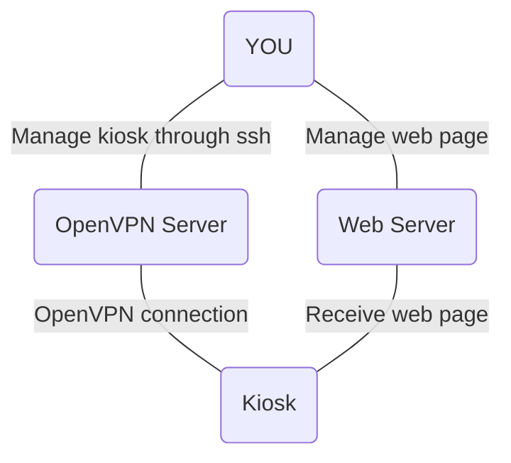

# Poor Man's Kiosk System

## <u>Overview</u>

Why another article about creating a Kiosk system if there are tons of articles out there in the wild? Because they are incomplete and only show you a small portion of the big picture.

Here I will try to explain how to create a complete and scalable kiosk system at almost no cost. At the end of the article you will be able to run a fleet of kiosks, that are easy to manage, secure, reliable and remotely accessible. Just running a Chromium browser with `--kiosk` command line argument isn't enough. You will need to assemble all the parts together to get a complete working system. 

Finishing this tutorial shouldn't take you longer than 2-3 hours.

Let's break it down into bits and see what properties our kiosk system must have?

- **cheap**

Since this is the Poor Man's Kiosk system, everything must be as cheep as possible(even cheaper) :) The cheapest hardware that is also capable of showing rich web content is the Raspberry Pi 4 Model B. It has two micro HDMI ports, DSI Display and CSI Camera connectors. This gives you plenty of options. The DSI connector allows you to connect a DSI compatible display like Raspberry Pi 7" Display. Raspberry Pi has its own Linux based operating system called Raspbian. It is also free, very well-supported and documented.

- **easy content management**

There is no easier way of making a rich and interactive content than the web pages. In this tutorial our content server will be a web server, serving web pages. The first web CMS that comes to my mind is WordPress. It is free, it is a pleasure to work with, it is very well-supported and documented.

- **scalable(manage 100+ kiosks)**

To be able to control 100+ kiosks, they must be easy to manage, and they should not jam your content server when the content needs to be updated.

To prevent jamming your content server's CPU and bandwidth, the web page will periodically execute a small JavaScript code that calls the WordPress's REST API and refresh the page only if it is required.

To have access to all the kiosks out there you need a concentration point to which they will connect. For that purpose we will use OpenVPN server. The kiosks will initiate an OpenVPN connection to your OpenVPN server and from there you will be able control them with ssh.

- **secure remote management**

The management will be done with ssh tunnel inside the OpenVPN tunnel. That's what you get when you go cheap :)

- **secure**

The kiosk system will be continuously connected to the internet, so It should have a decent enough security to prevent common day threats. To accomplish this we will use the Linux based OS with a configured firewall. The only open port will be that of the SSH server.

For an extra peace of mind we will install fail2ban to further improve the security of the ssh service.

If you want to make your kiosk impenetrable you can go one step further by routing the default route of the kiosks through the OpenVPN's tunnel. That way nothing will leak from the kiosk to its local network, but will put more pressure on your infrastructure.

The parts our kiosk system will be made of are:

* an endpoint kiosk device

* content server - used to serve the web pages

* concentration point - through which you will access the kiosks

## <u>Diagram</u>

A picture worth a thousand words.



## <u>Used technologies</u>

- Raspberry Pi 4 Model B with 2GB - the kiosk computer itself

- Raspberry Pi 7" Display(optional) or HDMI  enabled display or TV

- Raspbian OS

- iptables - for hardening the kiosk

- fail2ban - for hardening the kiosk

- ssh - for remotely managing the kiosk

- Chromium browser - for displaying the web content

- OpenVPN Client - for connecting to your OpenVPN server

- OpenVPN Server - central point to which all the kiosks will connect

- WordPress - to create the web pages that will be shown on the kiosks 

- WordPress Plugin Elementor (optional) - to create visual appealing content

- WordPress Plugin [Head, Footer and Post Injections](https://wordpress.org/plugins/header-footer/) - to inject a JavaScript + PHP code in the `<head>` tag

- PHP - to get the page modification time and page id

- JavaScript - code snippet that checks if the page is modified since last refresh

## <u>The endpoint kiosk computer</u>

This is the Poor Man's Kiosk so our endpoint must be as cheap as possible but powerful enough to run Chromium and a decently complex web content. For our kiosk system I chose the Raspberry Pi 4 Model B with 2GB. The RPi3 isn't capable of running complex content, but the forth iteration is. To take the full advantage of it's Video Core hardware I'll install the latest Raspbian from the original website: https://www.raspberrypi.org/downloads/raspbian/ . We need a minimal desktop environment without any applications preinstalled, so I chose [Raspbian Buster with desktop](https://downloads.raspberrypi.org/raspbian_latest).

The first step is to install Raspbian on the SD card. The easiest method is to use the `balenaEtcher` tool. It is a GUI application for burning image files. You can find it here: https://www.balena.io/etcher/ . Burn the downloaded Raspbian image to a micro SD card. Insert the card into the RPi board and switch the power on.

You can find more detailed instructions here: [https://www.raspberrypi.org/documentation/installation/installing-images/README.md](https://www.raspberrypi.org/documentation/installation/installing-images/README.md)

Configuring the OS to run as a kiosk require the following steps:

- Remove the unused applications

- Update the system

- Install `unclutter,` `fail2ban`, `openvpn`

- Configure the display(s)

- Enable and configure SSH server

- Hardening the system

- Configure the internet connection

- Timezone

- NTP client

- Configure a OpenVPN Client connection to your server

- Configure the Chromium browser to run automatically after reboot in kiosk mode

- Configure a cron job to restart the Chromium browser every day at midnight and a second job to reboot the whole RPi every Sunday at midnight. This will guarantee you some reliability if something goes wrong with the browser or the OS or the web page.

This is the most tedious part but it is alto the most important part and it must be done correctly or you may lose access to your kiosk. Consider this scenario: you have placed a kiosk in a kingdom far far away, then:

- you break the auto reload script on the web page(you will see later what I mean)

- the browser crashes

- the OS crashes

- something else crashes

- you lose access to the kiosk

- something unexpected happened and everything crashed

To be prepared for the above situations you must have a backup plan.

### Connect to the kiosk

You have two options for managing the kiosk:

- local keyboard and mouse

- remotely via ssh

In this tutorial I will connect the kiosk with an ethernet cable and will use ssh to access it. After you plug in the SD card start the OS, a wizard will pop up and will ask you to set up some basic settings like the locale, WiFi, etc. You can skip the update step, because we will update the system from the command line. After the wizard completes its job, it will ask you to reboot.

Now is time the fun to begin. Connect to the kiosk with ssh:

```bash
ssh pi@<IP>
```

**\<IP\>** the IP of the kiosk

The default password is `raspberry` .

### Remove bloatware

```bash
sudo apt purge thonny geany vlc -y
```

Remove packages that are not required anymore:

```bash
sudo apt autoremove -y
```

### Update the system

```bash
sudo apt update
sudo apt upgrade -y
sudo apt autoremove -y
```

### Install what is needed

```bash
sudo apt install unclutter openvpn fail2ban -y
```

**unclutter** hides your X mouse cursor

**openvpn** connect to the OpenVPN server

**fail2ban** adds another layer of security

### Display

It is not possible to cover every hardware configuration out there, so I strongly recommend you to read this article: https://www.raspberrypi.org/documentation/configuration/config-txt/README.md

Low level configuring of the RPI is done through this file:

```bash
/boot/config.txt
```

You can choose to use the built in micro HDMI ports or you can use the DSI connector with a compatible LCD display like the original Raspberry Pi 7" Touch Screen Display. 

Depending on your configuration, you may wish to rotate the display and the touchscreen. I also advise you to increase the GPU memory to at least 256MB.

**Increase the GPU memory**

```bash
sudo nano /boot/config.txt
```

Append `gpu_mem=<SIZE_IN_MB>` to the end of the file where `<SIZE_IN_MB>` is just the number of the megabytes. To set the memory to 256MB:

```
gpu_mem=256
```

**Rotate the LCD display(only if needed)**

You can skip this step if you are using HDMI or you do not need to rotate the display.

```bash
sudo nano /boot/config.txt
```

Append `display_rotate=<ORIENTATION>` to the end of the file where`<ORIENTATION>` value can be any of `0, 1, 2, 3`.

- `display_rotate=0` is default orientation 

- `display_rotate=3` is rotation 90° clockwise

- `display_rotate=2` is rotation 180° clockwise

- `display_rotate=1` is rotation 270° clockwise

In my case I need to rotate the display at 180°

```
display_rotate=2
```

**Rotate the touchscreen**

You can skip this step if you are using HDMI or you do not need to rotate the touchscreen.

```bash
sudo nano /usr/share/X11/xorg.conf.d/40-libinput.conf
```

Locate the section that corresponds to your touchscreen and append

`Option "TransformationMatrix" "<MATRIX>"` to the end of the section, where `<MATRIX>` can be any of the values below:

- `0 -1 1 1 0 0 0 0 1` is rotation 90° clockwise

- `-1 0 1 0 -1 1 0 0 1` is rotation 180° clockwise

- `0 1 0 -1 0 1 0 0 1` is rotation 270° clockwise

Since my LCD display is rotated 180°, I also need to rotate the touchscreen. This is how the whole section looks like

```
Section "InputClass"
    Identifier "libinput touchscreen catchall"
    MatchIsTouchscreen "on"
    MatchDevicePath "/dev/input/event*"
    Driver "libinput"
    Option "TransformationMatrix" "-1 0 1 0 -1 1 0 0 1"
EndSection
```

**HDMI overscan**

Sometimes when you use the HDMI connector you may see a black gap between the edges of the physican screen and those of the logical desktop. This gap is there because of the `overscan`. According to Wikipedia:

> Overscan is a behaviour in certain television sets, in which part of the
>  input picture is shown outside of the visible bounds of the screen. It 
> exists because cathode-ray tube (CRT) television sets from the 1930s 
> through to the early 2000s were highly variable in how the video image 
> was positioned within the borders of the screen. It then became common 
> practice to have video signals with black edges around the picture, 
> which the television was meant to discard in this way.

How to remove the gap? Luckily RPi can be configured through the `/boot/config.txt` file to fine tune the overscan or to completely disable it.

- **disable_overscan**=<0,1>

**0** enables the overscan

**1** disables the overscan

- **overscan_left**, **overscan_right**, **overscan_top**, **overscan_bottom**

this options accepts a numeric value which represent the pixels to add to the gap. Use positive numbers if console goes off screen, and negative if there is too much border.

In my case I will disable the overscan:

```bash
sudo nano /boot/config.txt
```

Add this line to the end of the file

```
disable_overscan=1
```

I do not need fine tuning, so I will leave the other options untouched.

### Change default username

We will delete the default `pi` user and add new one. We will call our new user `kiosk`. This is an important step since most of the breaches happen because of default settings left unchanged. This will increase the level of the security of your system.

Add a new user to the system:

```bash
sudo adduser kiosk
```

Give the new user the required permissions:

```bash
sudo usermod -a -G adm,dialout,cdrom,sudo,audio,video,plugdev,games,users,input,netdev,gpio,i2c,spi kiosk
```

If you need to change the password:

```bash
sudo passwd kiosk
```

Now logout with user `pi` and login again with the new user `kiosk`. After you confirm that the new account is working, it is time to delete the default `pi` user. Before you do that, you have to enable autologin into the desktop environment for the new user `kiosk`.

```bash
sudo raspi-config
```

- select `3 Boot Options`
- select `B1 Desktop / CLI`
- select `B4 Desktop Autologin Desktop GUI, automatically logged in as 'kiosk' user`

When you exit the `raspi-config`, it will ask you to reboot. If not then reboot manually:

```bash
sudo reboot
```

Login with the new user `kiosk`

```bash
ssh kiosk@<IP>
```

Kill all `pi` owned processes(if any) then delete the `pi` user itself:

```bash
sudo pkill -u pi
sudo deluser -remove-home pi
```

### SSH Server

Before we configure the ssh server, we will create a public/private key pair that will be used for passwordless login to the kiosk. This is important step that will save you a lot of time if you plan to manage more than one kiosk.

**Key-Based authentication preparation**

Repeatedly typing the login password is no fun at all. Enabling key-based authentication can eliminate this chore. Not only that but it will make your kiosk a little more secure.

You have to generate a pair of public and private keys on the machine that will be used for managing the kiosks and send the public key to the kiosk itself.

If you already have a public/private key pair then you can skip this step and use your key. If not, run this command on the machine that will manage the kiosks:

```bash
ssh-keygen -t ed25519 -b 512
```

The keys are stored by default in the `.ssh` folder in the user's home directory. The private key will be called `id_ed25519` and the associated public key will be called `id_ed25519.pub`. The key will be 512 bits ECC, which is roughly comparable to 15360 bits RSA.

Now you have to copy the public part of the key to your kiosk.

```bash
ssh-copy-id -p <PORT> kiosk@<IP-ADDRESS>
```

**\<PORT\>** change it to the current port of the ssh server. The default is 22. If you haven't changed it, you can omit this parameter

**\<IP-ADDRESS\>** change it to the IP of the kiosk you are connecting to

If for some reason you can not use `ssh-copy-id` you can do this manually. Run this command on the machine on which the key is generated:

```bash
cat ~/.ssh/id_ed25519.pub | ssh -p <PORT> kiosk@<IP-ADDRESS> 'mkdir -p /home/kiosk/.ssh && cat >> /home/kiosk/.ssh/authorized_keys'
ssh -p <PORT> kiosk@<IP-ADDRESS> 'chmod 0600 /home/kiosk/.ssh/authorized_keys'
```

**\<PORT\>** change it to the current port of the ssh server. The default is 22. If you haven't changed it, you can omit this parameter

**\<IP-ADDRESS\>** change it to the IP of the kiosk you are connecting to

**Configure the SSH server**

All the configuration of the sshd is conveniently located in a single file `/etc/ssh/sshd_config`.

```bash
sudo nano /etc/ssh/sshd_config
```

Add/Edit/Append the following lines to the file:

```
AllowUsers kiosk
Protocol 2
Port 51284
LoginGraceTime 2m
StrictModes yes
MaxSessions 1
PermitEmptyPasswords no
X11Forwarding no
AllowTcpForwarding no
ClientAliveCountMax 1
ClientAliveInterval 600
Compression yes
MaxAuthTries 2
TCPKeepAlive no
PermitRootLogin no
ChallengeResponseAuthentication no
PasswordAuthentication no
UsePAM no
```

If some of the options overlap with the defaults in the file, then comment the default ones. To get more information about each option, please Google for it.

**AllowUsers** allow only the `kiosk` user to be able to login using the ssh. If you have other users that has to be able to login, you can add them there.

**Protocol** use only ssh v2 protocol. If you are using an old ssh client you may have issues logging in.

**Port** don't use the default port 22

**LoginGraceTime** if the user doesn't start typing a username and password within 2 min, the session will close

**StrinctMode** specifies whether ssh should check user's permissions in their home directory and rhosts files before accepting login

**MaxSessions** allow only one session. If you need more than one session, change this line accordingly

**PermitEmptyPasswords** doesn't allow empty password for login

**X11Forwarding** disable the X11 forwarding

**AllowTcpForwarding** disable TCP forwarding

**ClientAliveCountMax** total number of checkalive message sent by the ssh server without getting any response from the ssh client

**ClientAliveInterval** timeout in seconds after which the ssh server will send a message to the client asking for response. If no response is received, the connection will close

**Compression** compress the data transmitted

**MaxAuthTries** maximum number of authentication attempts permitted per connection

**TCPKeepAlive** whether the system should send TCP keepalive messages to the other side

**PermitRootLogin** whether root can log in using ssh. If you are absolutely sure that you require root login, enable it. Accepted values are `yes`, `without-password`, `forced-commands-only` and `no`

**ChallengeResponseAuthentication** Specifies whether challenge-response authentication is allowed (e.g. via PAM or through authentication styles supported in login.defs(5))

**PasswordAuthentication** Specifies whether password authentication is allowed.

**UsePAM** enables the Pluggable Authentication Module interface. 

Restart the service for the changes to take effect:

```bash
sudo systemctl restart ssh
```

Now try to reconnect to the kiosk, but don't forget to use the new port `51284`:

```bash
ssh -p 51284 kiosk@<IP>
```

 If you can successfuly connect to it without entering the password you can count this paragraph a success.

### Hardening

- **make sudo require a password**

Since your kiosk will be exposed to the internet, it may somehow get compromised. Making `sudo` to require password will limit the damage the attacker can do.

```bash
sudo mv /etc/sudoers.d/010_pi-nopasswd /etc/sudoers.d/010_kiosk-passwd
sudo nano /etc/sudoers.d/010_kiosk-passwd
```

and change the `pi` entry to:

```
kiosk ALL=(ALL) PASSWD: ALL
```

Nothe that `NOPASSWD` has been also changed to `PASSWD`.

- **set up the firewall**

Another important step is the firewall. It will dramatically limit the attack vectors a malicious user can exploit.

A good practice is to redirect the ssh port to something else other than `22`. In this tutorial I will use port `51284`. We don't need protection at our loopback interface, so accept everything coming through it. On the outside we only need to open the ssh port and also accept any established connection. Everything else is dropped. Another good practice is to limit the ssh brute force attacks using the firewall. We will block any ip if it tries to make 5 new connections within a 2 minutes period. The firewall does not know if login attempts were successful or not, so keep in mind that if you initiate 5 successful connections, the firewall will block your IP address nonetheless.

```bash
sudo iptables -A INPUT -p tcp -m tcp --dport 51284 -m state --state NEW -m recent --set --name SSH --rsource
sudo iptables -A INPUT -p tcp -m tcp --dport 51284 -m recent --rcheck --seconds 120 --hitcount 6 --rttl --name SSH --rsource -j REJECT --reject-with tcp-reset
sudo iptables -A INPUT -p tcp -m tcp --dport 51284 -m recent --rcheck --seconds 120 --hitcount 5 --rttl --name SSH --rsource -j LOG --log-prefix "SSH brute force "
sudo iptables -A INPUT -p tcp -m tcp --dport 51284 -m recent --update --seconds 120 --hitcount 5 --rttl --name SSH --rsource -j REJECT --reject-with tcp-reset
sudo iptables -A INPUT -p tcp -m tcp --dport 51284 -j ACCEPT
sudo iptables -A INPUT -m conntrack --ctstate ESTABLISHED,RELATED -j ACCEPT
sudo iptables -A INPUT -i lo -j ACCEPT
sudo iptables -A INPUT -j DROP
```

Explanation

1. First rule:
   All packet coming on port 51284 with a `NEW` state will be marked with `SSH`.

2. Second rule:
   If this is the 6th packet coming on port 51284, then reject it. This will prevent your log files from getting too large.

3. Third rule:
   If an SSH connection packet comes in, and it's the 5th attempt from the same IP in 120 seconds, log it to the system, then immediately reject it.

4. Fifth rule:
   Any SSH packet not stopped so far, accept it.

Currently, the configured firewall will not be persistent after a reboot. Restoring the firewall requires a little bit more involvement. First you have to save the newly created iptables configuration:

```bash
sudo bash -c 'iptables-save > /etc/network/iptables.rules'
sudo chmod 0640 /etc/network/iptables.rules
```

Set the default policy of the `INPUT` and `FORWARD` chains to `DROP`.:

```bash
sudo nano /etc/network/iptables.rules
```

change the default policy for the `INPUT` and `FORWARD` chains to `DROP` by editing the two lines:

```
:INPUT DROP [0:0]
:FORWARD DROP [0:0]
```

Create a script that will load the firewall before the interface initialization:

```bash
sudo nano /etc/network/if-pre-up.d/firewall
```

Script content:

```bash
#!/bin/bash
/sbin/iptables-restore < /etc/network/iptables.rules
```

Escalate the permissons of the file:

```bash
sudo chmod 0750 /etc/network/if-pre-up.d/firewall
```

**NOTE: If you are using ssh to configure the kiosk, DO NOT apply the firewall rules before you have configured the SSH server or you will lose access. You can safely apply the firewall after you configure the SSH server**

- **configure fail2ban**

Configuring fail2ban to monitor the ssh server will add another line of defense against the bad guys. So what is fail2ban? In a nutshell, that is a log file scanner written in Python. It examines the log files of the running services in real time and if it catches a suspicious activity, it configures the firewall to block any further attempts from the abusing IP. The configuration files are located under `/etc/fail2ban/`.

Create a new config file:

```bash
sudo nano /etc/fail2ban/jail.d/kiosk.conf
```

Copy this section into the file:

```
[ssh]
enabled = true
port = 51284
filter = ssh
action = iptables[name=SSH, port=51284, protocol=tcp]mail-whois-lines[name=%(__name__)s, dest=%(destemail)s, logpath=%(logpath)s]
logpath = /var/log/auth.log
maxretry = 3
bantime = 900
```

Escalate the permissons of the file:

```bash
sudo chmod 0640 /etc/fail2ban/jail.d/kiosk.conf
```

Restart the service:

```bash
sudo systemctl restart fail2ban
```

To check if it is working correctly:

```bash
sudo fail2ban-server status
```

The output should look similar to this:

```
Status
|- Number of jail: 1
`- Jail list: sshd
```

### Internet connection

Since RPI is a Linux based computer, you can take advantage of all the standard Linux tools to connect your kiosk to the Internet. The build in options are Bluetooth, Ethernet, WiFi and USB. If Ethernet and WiFi are not enough for you, just plug in a supported USB device and use it instead for accessing the internet. In this tutorial I will show you how to set up a WiFi and Ethernet connection.

**WiFi**

Configuring the WiFi is a simple procedure:

```bash
sudo nano /etc/wpa_supplicant/wpa_supplicant.conf
```

Add a `network` section for each network you want to connect to. Sections with higher precedence must have higher `priority` number. For connecting to a hidden network, add `scan_ssid`  option.

```
network={
    ssid="<PRIMARY_SSID>"
    psk="<PASSWORD>"
    priority=2
}

network={
    ssid="<SECONDARY_SSID>"
    psk="<PASSWORD>"
    scan_ssid=1
    priority=1
}
```

If you are not sure about the SSID you can initiate a scan to list all available networks:

```bash
sudo iwlist wlan0 scan
```

Here is a very good article about setting up the WiFi: [https://www.raspberrypi.org/documentation/configuration/wireless/wireless-cli.md](https://www.raspberrypi.org/documentation/configuration/wireless/wireless-cli.md)

**Ethernet**

This is the easiest way to connect as it involves only plugging in the cable. The rest is setting up the TCP/IP. Head to the next paragraph.

**TCP/IP configuration**

You can configure the TCP/IP either manually or automatically through `dhcpd`.

- RPi by default uses `dhcpd` to automatically configure the TCP/IP across all of its interfaces. If the DHCP daemon fails, it falls back to automatic private addresses in the range 169.254.0.0/16. If you prefer this method, nothing else is required on your side.

- The manual configuration involves editing the `/etc/dhcpcd.conf` file.

```bash
sudo nano /etc/dhcpcd.conf
```

To setup the IP, default route and DNS servers, add a section with the following content:

```
interface <INTERFACE>
static ip_address=<IP>/<MASK>
static routers=<GATEWAY>
static domain_name_servers=<DNS1> <DNS2>
```

**\<INTERFACE\>** The name of the interface. To the full list of names of the interfaces, present on your system:

```bash
ip link
```

For example: **eth0**

**\<IP\>** The static IP assigned to the interface. For example: **192.168.1.100**

**\<MASK\>** The network mask. For example: **24**

**\<GATEWAY\>** The default gateway. For example: **192.168.1.1**

**\<DNS1\>** The primary DNS server. For example: **192.168.1.1**

**\<DNS2\>** The secondary DNS server. For example: **1.1.1.1**

A section with the applied examples from above may look like this:

```
interface eth0
static ip_address=192.168.1.100/24    
static routers=192.168.1.1
static domain_name_servers=192.168.1.1 1.1.1.1
```

**Hostname**

Since you are going to manage more than one kiosk, it is a good idea to give them a unique and descriptive names. 

```bash
sudo nano /etc/hostname
```

The file contains only one line - the hostname. Change it to `kiosk1` or something that suits your needs.

There is another file that contains the hostname - `/etc/hosts`. This file is a workaround for some software, therefore you should also edit it:

```bash
sudo nano /etc/hosts
```

Find the line starting with `127.0.1.1`, and change the name following it to your new hostname.

To apply the changes you have to reboot

```bash
sudo reboot
```

After the reboot check if the new hostname is applied:

```bash
hostname
```

### Timezone

Raspbian comes with the `timedatectl` utility preinstalled. This is the preferred method of configuring the time.

To list all the available timezones:

```bash
timedatectl list-timezones
```

To get more information about the current time settings:

```bash
timedatectl status
```

From the list choose your timezone and set it:

```bash
sudo timedatectl set-timezone <TIMEZONE>
```

**\<TIMEZONE\>** an entry from the list of timezones

### NTP

Setting the right time is a must, because tracking problems with the time set correctly is much easier.

Enable the NTP service:

```bash
sudo timedatectl set-ntp true
```

The last thing is to configure the synchronization servers

```bash
sudo nano /etc/systemd/timesyncd.conf
```

Uncomment out the line starting with `FallbackNTP` and replace default servers by the servers you want to use.

For example:

```
[Time]
FallbackNTP=0.bg.pool.ntp.org 1.bg.pool.ntp.org
```

### Autostart Chromium browser

To accomplish this task we will create a systemd service to run some commands that will prepare the system before the browser is run. Creating a separate script file is useless here, because we can put everything inside the service. Here is a detailed description of the commands.

- turn the X11 screen saver functions off

```bash
/usr/bin/xset s off
```

- sets the preference to display a pattern rather than blank the video

```
/usr/bin/xset s noblank
```

- disables DPMS (Energy Star) features

```
/usr/bin/xset -dpms
```

- Hide the mouse cursor

```bash
/bin/bash -c '/usr/bin/unclutter -idle 0.5 -root &'
```

This will hide the mouse cursor after 500ms. If you wish to hide it immediately, remove the `-idle` flag.

Another way to hide the pointer is to include a little CSS code in the web page.

```css
* {
    cursor: none;
}
```

You can use use both options at the same time. They will not interfere with each other.

- Search through the Chromium preferences file and remove any flags that would possibly trigger a warning dialog.

```bash
/bin/sed -i 's/"exited_cleanly":false/"exited_cleanly":true/' /home/kiosk/.config/chromium/Default/Preferences
/bin/sed -i 's/"exit_type":"Crashed"/"exit_type":"Normal"/' /home/kiosk/.config/chromium/Default/Preferences
```

- Finally run the Chromium browser

```bash
/usr/bin/chromium-browser --check-for-update-interval=31536000 --noerrdialogs --disable-infobars --autoplay-policy=no-user-gesture-required --enable-features=OverlayScrollbar --incognito --kiosk https://<YOUR_DOMAIN>/<YOUR_PAGE>
```

**--check-for-update-interval=31536000** Increase the update check interval to one year, to prevent the annoying popup to show

**--noerrdialogs** Does not show any error dialogs

**--disable-infobars** Does not show infobars

**--enable-features=OverlayScrollbar** Hides the scrollbars

**--incognito** Run the browser in incognito mode

**--autoplay-policy=no-user-gesture-required** Autoplay policy that does not require any user gesture

**--kiosk https://<YOUR_DOMAIN>/<YOUR_PAGE>** Run the browser in kiosk mode and load your content page.

It's restart policy must be set to `always` to prevent closing the browser by mistake.

Create a file:

```bash
sudo nano /lib/systemd/system/kiosk.service
```

 with the following content:

```bash
[Unit]
Description=Chromium Kiosk
Wants=graphical.target
After=graphical.target

[Service]
Environment=DISPLAY=:0.0
Environment=XAUTHORITY=/home/kiosk/.Xauthority
Type=simple
ExecStartPre=-/usr/bin/xset s off
ExecStartPre=-/usr/bin/xset s noblank
ExecStartPre=-/usr/bin/xset -dpms
ExecStartPre=-/bin/sed -i 's/"exited_cleanly":false/"exited_cleanly":true/' /home/kiosk/.config/chromium/Default/Preferences
ExecStartPre=-/bin/sed -i 's/"exit_type":"Crashed"/"exit_type":"Normal"/' /home/kiosk/.config/chromium/Default/Preferences
ExecStartPre=-/bin/bash -c '/usr/bin/unclutter -idle 0.5 -root &'
ExecStart=/bin/bash -c '/usr/bin/chromium-browser --check-for-update-interval=31536000 --noerrdialogs --disable-infobars --autoplay-policy=no-user-gesture-required --enable-features=OverlayScrollbar --incognito --kiosk https://ekon.bg/latex/kiosk-praktiker'
Restart=always
User=kiosk
Group=kiosk

[Install]
WantedBy=graphical.target
```

The `-` sign before the `ExecStartPre` commands is important. It tells the sysetmd that this command is of no importance and do not stop the service if it fails. When you run the service for the first time, the two `sed` commands will fail because the file `/home/kiosk/.config/chromium/Default/Preferences` doesn't exists.

Escalate the file permissions:

```bash
sudo chmod 0640 /lib/systemd/system/kiosk.service
```

Here the `DISPLAY ` variable is the tricky part. It's value is used by the operating system to know what screen to display the browser to. To get the current value open a console and type:

```bash
echo $DISPLAY
```

Then enable and run the service at boot time:

```bash
sudo systemctl enable kiosk.service
sudo systemctl daemon-reload
sudo systemctl start kiosk.service
```

### LCD Brightness

If you have connected a DSI LCD, you may wish to change the brightness at the system startup. To do that, a value between 1 and 255 must be written to the file `/sys/class/backlight/rpi_backlight/brightness'`.

Here is the full command that will set the brightness to \<NUMBER\>:

```
sudo /bin/bash -c 'echo <NUMBER> > /sys/class/backlight/rpi_backlight/brightness'
```

**\<NUMBER\>** can be any number between 1 and 255

Create another service `kiosk_brightness` that will run the command with root permissions:

```bash
sudo nano /lib/systemd/system/kiosk_brightness.service
```

with the following content:

```
[Unit] 
Description=LCD Backlight
Wants=graphical.target
After=graphical.target

[Service]
Type=oneshot
ExecStart=/bin/bash -c 'echo <NUMBER> > /sys/class/backlight/rpi_backlight/brightness'
User=root
Group=root

[Install]
WantedBy=graphical.target
```

Escalate the file permissions:

```bash
sudo chmod 0640 /lib/systemd/system/kiosk_brightness.service
```

Then enable the service at boot time:

```bash
sudo systemctl enable kiosk_brightness.service
sudo systemctl daemon-reload
```

Run the service:

```bash
sudo systemctl start kiosk_brightness.service
```

### Cronjob

To give yourself some peace of mind, you can schedule a periodic command that restarts the browser. For example, if for some reason the web page or browser crashes, there is no way to find out. Therefore, to prevent such ridiculous incidents, you can schedule a task that restarts your browser every day.

In the terminal:

```bash
sudo crontab -e
```

Add this line:

```
0 0 * * * systemctl restart kiosk.service
```

You can even restart the RPI itself, but in my humble opinion this is unnecessary precaution. But nonetheless, here's how to do it every Sunday:

```
0 0 * * 0 reboot
```

### OpenVPN

To be able to manage all our endpoints we must have access to all of them. This can be easily done using the OpenVPN Client and Server. We can make all the endpoints to connect to the OpenVPN server the moment they get access to a network, but before that you have to configure a OpenVPN Server on a static IP. If you want to make the setup more reliable you can create an `A` Record in your DNS server to point to this IP. That way if you change the IP for some reason you can redirect all your endpoints to the new one by simply changing the `A` record.

Create an OpenVPN config file:

```bash
sudo nano /etc/openvpn/kiosk_ovpn.conf
```

```
client 
remote <DOMAIN> <PORT>
auth-user-pass /etc/openvpn/kiosk_ovpn_auth.txt 
cipher AES-256-CBC 
dev tun 
proto tcp 
nobind 
auth-nocache 
script-security 2 
persist-key 
persist-tun 

# Put your CA between those two tags
<ca>
</ca>
```

Escalate the file permissions:

```bash
sudo chmod 0640 /etc/openvpn/kiosk_ovpn.conf
```

The username and password can be put here: `/etc/openvpn/kiosk_server_auth.txt`. This file contains only two lines. First line is the username and second line is the password.

```bash
sudo nano /etc/openvpn/kiosk_ovpn_auth.txt
```

```
<USERNAME>
<PASSWORD>
```

Escalate the file permissions:

```bash
sudo chmod 0640 /etc/openvpn/kiosk_ovpn_auth.txt
```

To auto start the VPN you have to enable the `systemd` service:

```bash
sudo systemctl enable openvpn@kiosk_ovpn.service
sudo systemctl daemon-reload
```

Start OpenVPN with the following command:

```bash
sudo systemctl start openvpn@kiosk_ovpn.service
```

Wait a couple of seconds and see if the service is working correctly:

```bash
sudo systemctl status openvpn@kiosk_server
```

List the network interfaces and see if interface `tun0` is present:

```bash
sudo ip a
```

### Final check

Before we make our final check, reboot the kiosk.

```bash
sudo reboot
```

- check if LCD Display power saving options are applied

```bash
DISPLAY=:0.0 xset q
```

- Firewall rules - check if all the rules are applied and the default policy for `INPUT` and `FORWARD` chains is set to `DROP`

```bash
sudo iptables -L
```

- fail2ban - check if the ssh rule is applied

```bash
sudo fail2ban-server status
```

- OpenVPN client - check if the client is running and the `tun0` interface is present

```bash
sudo systemctl status openvpn@kiosk_ovpn
ip a
```

- hostname - check if the current hostname is set to `kiosk1`

```bash
hostname
```

- cron - check if the cron job is present

```bash
sudo crontab -l
```

- brightness - check if the brightness is set to `130`

```bash
sudo /bin/bash -c 'cat /sys/class/backlight/rpi_backlight/brightness'
```

## <u>Streaming Server</u>

For streaming our content we will use a Wordpress website.

Why Wordpress? Because it supports a REST API. It is free. It is very easy to work with. There is a ton of documentation. The list goes on and on. You can use another platform of your choice that has support for REST API and more specifically to read the modification date and time of a page.

Why do you need a REST API? I will explain in a second.

The first thing is to create a page that will be presented on the kiosk display. For this task my personal tool of choice is the Elementor page builder. You can use any other page builder. The point here is to create a visual appealing page. 

To keep the content always updated  you have to refresh the page whenever there is a modification. You are left with two choices:

- The smarter approach is to execute a small REST API call using JavaScript on the page itself that checks if the page modification time is newer than the last time the page was loaded. If it is newer then reload the page.

Luckily for us, the Wordpress supports such REST API call: 

```
https://<YOUR_DOMAIN>/wp-json/wp/v2/pages/{id}
```

You can see it's description here: https://developer.wordpress.org/rest-api/reference/pages/

Calling this URL with the `{id}` of the kiosk page will return a JSON object. It contains a value called `modified` that stores the last time the page was modified. I bet you see where this is going. Between the `<head></head>` tags you just create a JavaScript element that fetches the JSON object and compare the new value of  `modified`  to the currently known modification time.

This is the snippet you have to inject into your page's head tag:

```javascript
<script type="text/javascript">
    // Hold the modification time at the moment the page is generated by the server
    var page_modified = new Date("<?php echo get_post()->post_modified; ?>");
    // Hold the ID of the page
    var page_id       = <?php echo get_post()->ID; ?>;

    // Call a function every couple of milliseconds.
    window.setInterval('refresh()', 60000);     

    // Calls the WordPresses REST API and reload page if it's modification time is newer than the modification time when the page was generated by the server
    function refresh() {
        fetch("/wp-json/wp/v2/pages/" + page_id).
        then((res) => res.json()).
        then((data) => 
        {
            var page_modified_new = new Date(data.modified);
            if(page_modified_new > page_modified)
                // Clear the cache and reload the page 
                window.location.reload(true); 
        }).
        catch((error) => 
        {
            console.log("Error accessing the REST API:" + error);
        });
    }
</script>
```

You have to insert this between the `<head></head>` of your page. Please note that this is mixed PHP and JavaScript. I have accomplished this using this Wordpress plugin [Head, Footer and Post Injections](https://wordpress.org/plugins/header-footer/). I am sure there are other free plugins out there that allow you to inject this code in the head of the page.

- DO NOT DO THIS. The dumbest approach is to constantly refreshing the page, no matter if the page needs to be updated or not. Again, this is not recommended because if you have a lot of endpoints they will slow down your web server and will also generate a lot of traffic. With this approach you can NOT scale. If you are absolutely sure that this is your way, I will show you how to shoot yourself in the foot.

First way is to use `xdotool`.  Install the package with:

```bash
sudo apt install xdotool -y
```

Create a new script called `/home/kiosk/kiosk.sh`:

```bash
nano /home/kiosk/kiosk.sh
```

Add this content:

```bash
/usr/bin/chromium-browser --check-for-update-interval=31536000 --noerrdialogs --disable-infobars --autoplay-policy=no-user-gesture-required --enable-features=OverlayScrollbar --incognito --kiosk https://<YOUR_DOMAIN>/<YOUR_PAGE> &

while true; do
   xdotool key --clearmodifiers ctrl+r;
   sleep 60
done
```

Don't miss the `&` at the end of the `/usr/bin/chromium-browser` command. Modify the `/lib/systemd/system/kiosk.service` to run this script.

Second way is to use a cronjob. In a terminal:

```bash
crontab -e
```

Add this line:

```
*/1 * * * * xdotool key --clearmodifiers ctrl+r
```

Note here that `cron` does not go down to sub-minute resolution, therefore the least interval you can refresh your page is one minute.

## <u>Managing your endpoints</u>

In the beginning of the tutorial I noted that you will manage your fleet of kiosks with ssh through the OpenVPN connection. The concentration point where all the kiosks will connect to will be the OpenVPN server. You have to configure it to route the connected kiosks to an interface that is accessible from your managing computer. 

If your fleet is large, lets say 100+ kiosks, doing the simplest task multiplied 100+ times can turn into a scary nightmare. Your best friend with dealing with this chaos are the terminal multiplexers. They have the ability to split your screen into multiple panels, where each panel represents a different terminal session. My favourite one is `byobu`. It is using `tmux` as a back end, but adds a couple of nifty features to it. One of the features I love is the ability to synchronize all the sessions. This allows you to multiply the command for each session.

On your local managing computer:

```bash
byobu
```

Create as many splits as your screen can accommodate:

```
Ctrl-F2  - creates a vertical split
Shift-F2 - creates a horizontal split
Shift-F3 - move focus to the next split
Shift-F4 - move focus to the next split

Shift+F8 - toggle through split arrangements
```

In each split connect to a different kiosk:

```bash
ssh -p 51284 kiosk@<IP>
```

**\<IP\>** Local IP of the kiosk assigned by the OpenVPN server

Now is time for magic. `byobu` has two options for sending a command to each split.

- `Shift-F9` runs one command in all splits

- `Alt-F9` toggle sending keyboard input to all splits

If the number of kiosks is larger than the splits your screen can accommodate, just create another window with `F2` and repeat the procedure described above. To cycle between windows:

```
F3 - move focus to previous window
F4 - move focus to next window
```

## <u>Author</u>

Emil Kondayan

## <u>Resources</u>

https://www.raspberrypi.org/documentation/configuration/security.md

https://www.raspberrypi.org/documentation/configuration/wireless/wireless-cli.md

https://www.raspberrypi.org/documentation/configuration/config-txt/README.md

https://www.raspberrypi.org/documentation/configuration/tcpip/README.md

https://www.instructables.com/id/Rotate-Raspberry-Pi-Display-and-Touchscreen/
